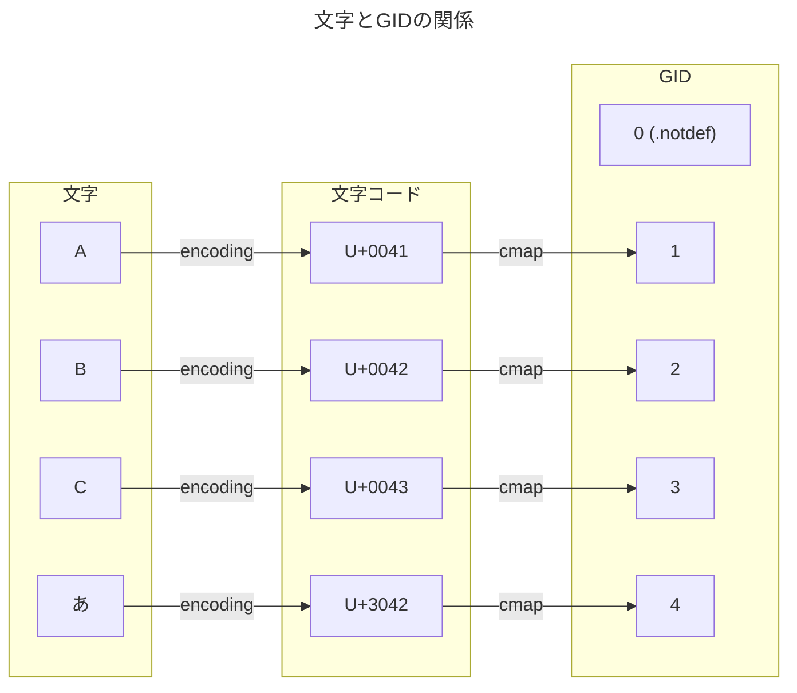
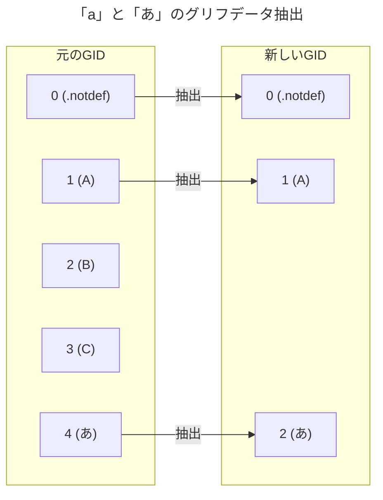

# OpenTypeフォント抽出

PDFにフォントを埋め込むためにOpenTypeから使用するグリフのみを抽出してPDFに埋め込む。  
フォーマットの仕様はMicrosoft、Appleの仕様を参照すること。  
ここではPDFにフォントを埋め込むための抽出処理について解説する。  

* [https://learn.microsoft.com/ja-jp/typography/opentype/spec/](https://learn.microsoft.com/ja-jp/typography/opentype/spec/)
* [https://developer.apple.com/fonts/TrueType-Reference-Manual/](https://developer.apple.com/fonts/TrueType-Reference-Manual/)

## OpenType

OpenTypeフォントはTrueType(TTF)形式とCompact Font Format(CFF)形式のデータを格納できるようにしたものである。  
CFF形式のデータは[sfntフォーマット](https://en.wikipedia.org/wiki/SFNT)のCFFテーブルとして格納される。  

TTF形式とCFF形式では次の違いがある。  

| 相違点             | TrueType(TTF)形式                              | Compact Font Format(CFF)形式             |
|--------------------|------------------------------------------------|------------------------------------------|
| SFNTバージョン     | 0x00010000 または 0x74727565(true)             | 0x4F54544F(OTTO)                         |
| 共通テーブル       | cmap、head、hhea、hmtx、maxp、name、OS/2、post | cmap、head、hhea、hmtx、maxp、name、post |
| グリフ格納テーブル | glyf、loca                                     | CFF または CFF2                          |
| 拡張子             | .TTF、.OTF                                     | .OTF                                     |
| アウトライン       | 2次ベジェ曲線                                  | PostScriptベース、3次ベジェ曲線          |

[Microsoftの仕様ではTTFのSFNTバージョンは0x00010000](https://learn.microsoft.com/ja-jp/typography/opentype/spec/otff#font-tables)のみだが、[Appleの仕様では0x74727565](https://developer.apple.com/fonts/TrueType-Reference-Manual/RM06/Chap6.html)がある。  
[Microsoftの仕様ではOS/2が必須テーブル](https://learn.microsoft.com/ja-jp/typography/opentype/spec/otff#font-tables)とされているが、[Appleの仕様ではオプション](https://developer.apple.com/fonts/TrueType-Reference-Manual/RM06/Chap6.html)とされている。  
Macにインストールされているフォントでは0x74727565やOS/2テーブル無しのTTFフォントがある。  

OpenTypeとTrueTypeの比較がされることがあるが、一般にOpenTypeとされているのはCFFフォントであることが多い。  

1つのフォントファイルに複数のフォントファイルを格納できるフォントコレクション(ヘッダ ttcf、拡張子 .TTC)がある。  

### CFFテーブル

CFFフォントではCFFテーブルにCompact Font Format形式のデータが格納されている。  

* [http://partners.adobe.com/public/developer/en/font/5176.CFF.pdf](http://partners.adobe.com/public/developer/en/font/5176.CFF.pdf)
* [http://partners.adobe.com/public/developer/en/font/5177.Type2.pdf](http://partners.adobe.com/public/developer/en/font/5177.Type2.pdf)

## フォントの構造

コンピュータでは文字はUnicodeなどのコードポイント(文字コード)で現わされる。  
フォントファイル内では文字コードではなくGlyph ID(GID)で格納される。  
GIDは1から連番で始まり、GIDの0は.notdefというフォントファイル内に文字が無いことを現わす。  
これは同じ文字コードでも異なるグリフが割り当たることがあるためである。  
PDFでOpenTypeフォントを使用する場合はGIDを指定することになる。  

文字コードとGIDを変換するのがcmapである。  
OpenType内のcmapテーブルがあるが、PDFではTo Unicode CMapを利用する。  

## フォント抽出

フォントファイルには多数のグリフデータが格納されている。  
日本語のフォントファイルであれば数万種が格納されている。  
PDFにフォントファイルを埋め込む際に使用しない文字のグリフデータまで含めるとファイルサイズが肥大化する。  
そのためPDFファイル内で使用しているグリフデータのみを抽出したフォントファイルを作成して埋め込みたい。  

## TTF、CFFの共通部分抽出

グリフデータを抽出にあたり、必須テーブルのグリフ数、グリフデータに関するパラメータを変更する必要がある。  

| テーブル | 抽出方法                                  |
|----------|-------------------------------------------|
| cmap     | 抽出したGIDに合わせた変換が必要           |
| head     | 変換不要                                  |
| hhea     | numberOfHMetricsを抽出したグリフ数に設定  |
| hmtx     | hMetricsを抽出したGIDに合わせた変換が必要 |
| maxp     | numGlyphsを抽出したグリフ数に設定         |
| name     | 変換不要                                  |
| OS/2     | 変換不要                                  |
| post     | 変換不要                                  |

### cmapの抽出

* [https://learn.microsoft.com/ja-jp/typography/opentype/spec/cmap](https://learn.microsoft.com/ja-jp/typography/opentype/spec/cmap)
* [https://developer.apple.com/fonts/TrueType-Reference-Manual/RM06/Chap6cmap.html](https://developer.apple.com/fonts/TrueType-Reference-Manual/RM06/Chap6cmap.html)

#### プラットフォーム
フォントデータ内には様々なプラットフォームやエンコード向けに複数のcmapが含まれている。  
プラットフォームは次の種類があるがPDFに埋め込む場合はUnicodeにのみ対応すれば十分である。  

| プラットフォーム | 名前         |
|------------------|--------------|
| 0                | Unicode      |
| 1                | Macintosh    |
| 2                | ISO (非推奨) |
| 3                | Windows      |
| 4                | Custom       |

#### プラットフォームUnicodeにおけるエンコーディング

プラットフォームにUnicodeを選択した場合は次のエンコーディングを指定する必要がある。  
PDF埋め込みにおいて、採用すべきは基本多言語面のみであれば3、サロゲートペアを扱う場合は4までである。  

| エンコーディング | 名前                         | 補足             |
|------------------|------------------------------|------------------|
| 0                | Unicode 1.0 (非推奨)         |                  |
| 1                | Unicode 1.1 (非推奨)         |                  |
| 2                | ISO/IEC 10646 (非推奨)       |                  |
| 3                | Unicode 2.0 基本多言語面のみ | U+0000～U+FFFF   |
| 4                | Unicode 2.0                  | U+0000～U+10FFFF |
| 5                | Unicode variation sequences  | Format 14専用    |
| 6                | Unicode full repertoire      | Format 13専用    |

#### フォーマット

PDFでOpenTypeフォントを使用する場合はGIDを指定するため、文字コードからGIDへの変換を行うcmapは重要ではなく、UVSを実装する意味は薄い。  
そのため全cmapフォーマットを作成する必要はない。  
日本語のフォントファイルであればFormat 12のみ実装すればよい。  

| サブテーブル | 文字コード範囲                 | 格納可能グリフ数 |
|--------------|--------------------------------|-----------------:|
| Format 0     | U+0000～U+00FF                 |            256個 |
| Format 2     | U+0000～U+FFFF                 |          65536個 |
| Format 4     | U+0000～U+FFFF                 |          65536個 |
| Format 6     | U+0000～U+FFFF(連続したコード) |          65536個 |
| Format 8     | U+0000～U+10FFFF               |          65536個 |
| Format 10    | 32bit(使用されない)            |          65536個 |
| Format 12    | U+0000～U+10FFFF               |          65536個 |
| Format 13    | 32bit(多対一)                  |          65536個 |
| Format 14    | UVS(SVS+IVS、異字体)           |          65536個 |

1つのフォントファイルに格納できるグリフ数は65536個が上限である。  
GID 0は.notdefになるため、実際に使用できるグリフ数は上記の格納グリフ数より1個少なくなる。  

#### 補足:Windows環境での単体フォントファイル

PDF埋め込みではなくWindows環境で単体のフォントファイルとして扱うのであればプラットフォーム 3:Windowsを含む必要がある。  
最低限エンコーディング 1、Format 4を含まないと有効なフォントファイルとみなされない。  
それ以外を実装する意味はないであろう。  

| エンコーディング | 名前                    | 補足      |
|------------------|-------------------------|-----------|
| 0                | Symbol                  |           |
| 1                | Unicode 基本多言語面    | Format 4  |
| 2                | ShiftJIS                |           |
| 3                | PRC                     |           |
| 4                | Big5                    |           |
| 5                | Wansung                 |           |
| 6                | Johab                   |           |
| 7                | 予約済み                |           |
| 8                | 予約済み                |           |
| 9                | 予約済み                |           |
| 10               | Unicode full repertoire | Format 12 |

* [https://learn.microsoft.com/ja-jp/typography/opentype/spec/cmap#windows-platform-platform-id--3](https://learn.microsoft.com/ja-jp/typography/opentype/spec/cmap#windows-platform-platform-id--3)

## TTFのフォント抽出

TTF形式はグリフ数分のglyf、locaテーブルを抽出する必要がある。  
locaの配列の差分がglyfの長さになるため、glyfをGIDの昇順に出力する。  

### glyfの抽出

グリフデータにはSimple glyphとComposite glyphがある。  
どちらも座標データのみであるため、抽出を行うだけであれば中身を解析する必要はない。  

## CFFのフォント抽出

## カラーグリフについて

## カラーグリフのフォント抽出
