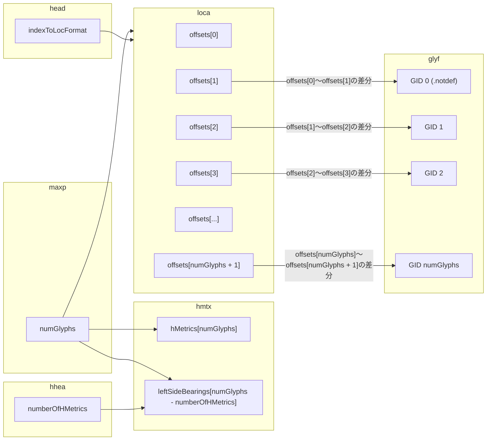

# TrueTypeデータ読み込み

TTF形式はグリフ数分のglyf、locaテーブルを抽出する必要がある。
locaテーブルにはglyfテーブルの長さの情報が入っている。
glyfテーブルにはグリフのアウトライン情報が格納されている。
関連するテーブルをまとめると以下のようになる。

## locaテーブル

locaの配列の差分がglyfの長さになる。
アウトライン情報がない場合は差分がゼロ(offsets[GID] == offsets[GID + 1])になる。
headのindexToLocFormatが0の場合、locaは実際のオフセットを2で割った値が格納されている。

## glyfテーブル

グリフデータにはSimple glyphとComposite glyphがある。
どちらも座標データのみであるため、抽出を行うだけであれば中身を解析する必要はない。
headのindexToLocFormatが0の場合、2バイトアライメントにする必要がある。

* [TrueTypeラスタライズ](TrueTypeラスタライズ)
