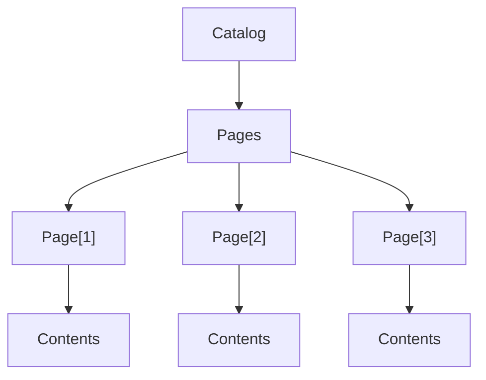

# カタログ構造

PDFのボディー部はカタログ(Catalog)を頂点とするツリー構造になっている。
ページツリー(Pages)には各ページ(Page)の配列を持っている。
ページにはフォントや画像などのリソース情報と、コンテンツ内容(Contents)を持っている。



1ページのみ、白紙のPDFのサンプルは次のようになる。

* [白紙PDF](sample/nodata-01_Blank.pdf){:target="_blank"}

## コンテンツストリーム

コンテンツにはストリームでページの内容が記載される。
スタックベースのコマンド後置き記法が使用される。
``%``以降がコメントとなる。
座標は左下を(0,0)とする。(数学の座標と同じ)

### テキスト描画

``BT``と``ET``で囲んだ間にテキスト描画オペレータを記述する。

```
BT
  /F0 10 Tf        % フォント/F0をサイズ10で指定
  100 200 Td       % 左から100、下から200の位置にテキスト描画位置をセット
  (Hello World) Tj % "Hello World"を描画
ET
```

PicoPDFではOpenTypeフォントをGID指定するため、Tjオペレータで指定するのはGIDになる。

### パス描画

``q``と``Q``で囲んだ間にパス描画オペレータを記述する。

```
q
  0 0.5 1 RG % 前景色をR=0、G=0.5、B=1で設定する、カラーコードであれば#0080FFである
  1 w        % 線の幅を1にする
  100 200 m  % 左から100、下から200の位置に描画位置をセット
  25 50 l    % 相対位置を左から25、下から50に移動しラインを設定
  S          % ラインを描画
Q
```

